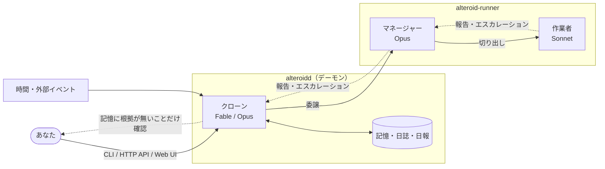

<p align="center">
  <picture>
    <source media="(prefers-color-scheme: dark)" srcset="./.github/assets/logo-dark.svg">
    
  </picture>
</p>

<p align="center">
  <b>Claude Code に仕事を頼む「あなた」を、AI のクローンが代わりに務める。</b>
</p>

<p align="center">
  <a href="./LICENSE"></a>
  <a href="https://github.com/takecchi/alteroid/actions/workflows/ci.yml"></a>
  
</p>

<p align="center">
  <a href="#alteroid-とは">alteroid とは</a> ·
  <a href="#できること">できること</a> ·
  <a href="#画面">画面</a> ·
  <a href="#はじめる">はじめる</a> ·
  <a href="#仕組み">仕組み</a> ·
  <a href="#ドキュメント">ドキュメント</a>
</p>

<!-- 画像の実体は orphan 枝 `assets` に在る（main は NUL バイトを許さない歯があるので PNG を置けない。#260）。その枝を消すとこの文書の画像が全部切れる -->


## alteroid とは

いま、あなたは PC の前に座って Claude Code に作業を頼み、出てきたものを読み、次の指示を出しています。
仕事が進む速さは、**あなたが席にいられる時間**で決まります。

alteroid は、この「あなた」の席に **あなたの価値観を写し取ったクローン（AI）** を座らせます。

> **人間が PC の前に座り、Claude Code に作業を依頼して物事を進める。**
> alteroid はこれを、人間の代わりにクローン（AI）が行うようにするためのツールである。
> — [docs/north_star.md](./docs/north_star.md)

クローンは、アイデアを AI に相談し、調査を頼み、実装を指示し、結果をレビューします。あなたが寝ている間も動きます。
あなたの役目は **価値観を伝えることと、最終的な承認** だけになります。

クローンは「権限を絞った自動化ジョブ」ではありません。**あなたが Claude Code でできることは、クローンの階層でも全部できる**
—— これがこのプロダクトの憲法です（できないなら、それは仕様ではなくバグとして扱います）。

## できること

### 🧠 あなたの価値観を覚える

会話から目的・価値観・好みを蒸留して、**記憶** として溜めていきます。記憶はいつでも読めて、直接書き換えられます。
「何を任せてよくて、何は必ず聞いてほしいか」も、設定項目ではなく記憶として持ちます。

### 🏢 3層の AI 組織で動く

| 層               | 担当                                                         | モデル                         |
| ---------------- | ------------------------------------------------------------ | ------------------------------ |
| **クローン**     | あなたの代理。最終判断と記憶を持つ                           | Fable または Opus（既定 Opus） |
| **マネージャー** | あなたが普段使う Claude Code に当たる層。仕事を進める        | Opus                           |
| **作業者**       | マネージャーが切り出した実作業（実装・調査・確認・レビュー） | Sonnet                         |

判断の質が要る層に上位モデルを置き、量の出る実作業を下の層へ回します。判断できないことは上の層へ上がり、結果は要約されて上へ届きます。

### ⏰ 席を外していても進む

仕事の起点は、あなたの依頼だけではありません。

- **あなたの依頼** — `alteroid chat`、Web UI、HTTP API のどこからでも
- **時間** — 日報や定期の見直し。cron と同じ書き方で周期を足せます
- **外部イベント** — 失敗した CI、レビュー依頼、MCP 経由の通知
- **クローン自身の発意** — 記憶にある目的から、次にやることを自分で決めます

承認が要る仕事は止まりますが、止まるのは **その仕事だけ** です。他の仕事は進み続けます。

### 🙋 聞くべきことだけ聞く

何をあなたに確認し、何を確認せずに進めるかは、**記憶に根拠があるか** でクローンが判断します。
最初は質問が多く、価値観が溜まるほど減っていきます。一度「それはやっていい」と答えれば、以後の同じ種類の判断に効きます。

### 📒 全部、後から見える

| 層                 | 中身                                                                 |
| ------------------ | -------------------------------------------------------------------- |
| **日報**           | 今日何をしたか・何が決まったか・何が保留か。普段はこれだけ読めばよい |
| **日誌**           | 層どうしのやり取り、聞かずに実行した判断、ツール実行の記録           |
| **セッションログ** | 各セッションの生のトランスクリプト                                   |

聞かずに実行した判断は必ず日誌に残るので、後から追って否定できます。その否定が、次の記憶になります。

### 🔁 仕事のやり方を自分で直す

**仕事のやり方**（依頼文の型、どこで切り出すか、何で検証するか）を書き留め、直していきます。
何を「良い結果」とするかの基準は、あなたの記憶の側に置きます。

### 🔌 入口は3つ、中身は1つ

**CLI**（`alteroid`）・**HTTP API**（`GET /openapi.json`）・**Web UI** のどれからでも、同じことができます。
どの入口も同じ API の上に乗っていて、片方でしかできないことは作りません。外部サービスとは **MCP** で繋がります。

## 画面

**会話** — クローンと話す（`alteroid chat` と同じことができる）


**記憶** — クローンの価値観そのもの。いつでも読んで直せる


ほかに、承認待ち・未了の仕事・作業の進捗・マネージャー・日誌・日報・利用状況・スケジュールなどの画面があります
（配置と接続先の決まり方は [apps/web/README.md](./apps/web/README.md)）。

## はじめる

必要なもの:

- **Claude のサブスクリプション**（`claude setup-token` で発行する認証トークンを使います）。
  Bedrock などの他の経路は下の「[使える LLM](#使える-llm)」を参照してください
- **Docker**（コンテナで動かす場合）または **Node 22 + pnpm**（手元で動かす場合）

### コンテナで動かす（docker compose）

デーモン / manager-runner / PostgreSQL の3コンテナ構成です。

```sh
cp .env.example .env        # 2つ埋める（下記）
docker compose up -d
docker compose exec app alteroid token add --label <名前> -f <path>  # 認証トークンを登録
docker compose exec app alteroid chat
```

`.env` に要るのは2つだけです。

| 変数                    | 取り方                                                                                  |
| ----------------------- | --------------------------------------------------------------------------------------- |
| `ALTEROID_RUNNER_TOKEN` | `openssl rand -hex 32`。**app と runner で同じ値**                                      |
| `ALTEROID_DATABASE_URL` | `postgres://alteroid:<openssl rand -hex 16>@db:5432/alteroid`。内蔵 `db` もここから起動 |

**クローン・マネージャーの認証（`claude setup-token`）は環境変数では持ちません**
（2026-09-14 に廃止）。正本は認証トークンのプール（DB）だけで、上の
`alteroid token add` で登録します。1本も登録していないと、クローンもマネージャーも
走れません。

**道具の鍵や PATH を `.env` に増やさないでください。** それは実行環境プロファイル（`alteroid profile edit`）
の側で、器を焼き直さずに差し替えられます。alteroid 自身の運用設定（TZ 等）も
`alteroid credential` / Web UI の「環境変数」画面で置きます（一部は初回起動時に
既定値が入ります）。境界の説明は [.env.example](./.env.example) と
[compose.yaml](./compose.yaml) の冒頭にあります。

### 手元で動かす（Node）

実行系の版は [mise.toml](./mise.toml) に一本化してあります（CI も同じファイルを読みます）。

```sh
mise install        # Node 22 / pnpm。使わないなら corepack enable
pnpm install
pnpm build          # **build が先。** ワークスペース間の型解決が各パッケージの dist/ に依存する
```

CLI の実体は `apps/cli/dist/index.js` です。PATH に置くなら、コンテナと同じ形で繋ぎます:

```sh
ln -sf "$PWD/apps/cli/dist/index.js" /usr/local/bin/alteroid
alteroid init       # 人格データディレクトリ（~/.alteroid）を作る
alteroid chat       # クローンと会話する（デーモンが居なければ自分で起こす）
```

- デーモンの待ち受けは `ALTEROID_PORT`（既定 4517）。接続先と pid は `$ALTEROID_HOME/state/daemon.json`
- 人格データは `ALTEROID_HOME`（既定 `~/.alteroid`）、マネージャーの作業ディレクトリは
  `ALTEROID_WORKSPACE`（既定はデーモンの cwd）
- **試すときは、両方とも捨ててよい一時ディレクトリを指してください。** 既定のままだと自分の記憶と
  実プロジェクトを直に触ります

Web UI の立ち上げ方と置き方は [apps/web/README.md](./apps/web/README.md) にあります。
手順の詳細は [.claude/skills/running-alteroid/SKILL.md](./.claude/skills/running-alteroid/SKILL.md)。

### クラウドに常駐させる

[railway/README.md](./railway/README.md)（Railway。runner は N 台に増やせます）。
端末を閉じても走り続けること以外、ローカルと能力は変わりません。

<details>
<summary><b>CLI の主なコマンド</b></summary>

| コマンド                            | 何をするか                                                |
| ----------------------------------- | --------------------------------------------------------- |
| `alteroid init`                     | 人格データディレクトリを初期化する                        |
| `alteroid chat`                     | クローンと会話する。中は `/help` でスラッシュコマンド一覧 |
| `alteroid daemon start/stop/status` | 常駐デーモンの操作                                        |
| `alteroid memory ...`               | 記憶（人格）を読む・書き換える・消す                      |
| `alteroid profile ...`              | 実行環境プロファイル（`~/.zprofile` に当たるもの）        |
| `alteroid mcp ...`                  | MCP サーバの登録（`.mcp.json` に当たるもの）              |
| `alteroid integration ...`          | 連携の鍵（外のサービスが外部イベントを送るための鍵）      |
| `alteroid token ...`                | 認証トークンのプール（枠に当たったときに回す候補）        |
| `alteroid usage`                    | 使った分（トークンと費用）を見る                          |
| `alteroid runners`                  | 委譲先の器と、いま走っている版を見る                      |
| `alteroid runners vacate <id>`      | その器を空ける（載っている委譲を他の器へ移す）            |
| `alteroid conversations ...`        | 会話の履歴を読む                                          |
| `alteroid dropped`                  | 握り潰しの跡を見る                                        |
| `alteroid login/logout/whoami`      | この端末用のアクセストークン                              |
| `alteroid access ...`               | ログインしたアカウントへ使用許可を与える・取り消す        |

HTTP API の仕様は `GET /openapi.json`（OpenAPI 3.1）、人間が読むなら `GET /docs` です。

</details>

## 使える LLM

alteroid の各層（クローン・マネージャー・作業者）は、Claude Agent SDK が起こす **Claude Code** の上で走ります。
だから、**Claude Code が対応している経路はそのまま使えます。** Claude Code の環境変数（`ANTHROPIC_BASE_URL` など）を
SDK の子プロセスまで届ければ切り替わります。Claude に限りません。ただし、Claude 以外は公式の対応外です。

| 経路                                                                                                | 位置づけ                                                                                                                                                      |
| --------------------------------------------------------------------------------------------------- | ------------------------------------------------------------------------------------------------------------------------------------------------------------- |
| **Anthropic の Claude**（サブスクリプション・API キー）                                             | 既定。設計と品質の基準はここです                                                                                                                              |
| **Amazon Bedrock / Google Cloud's Agent Platform（旧 Vertex AI）/ Microsoft Foundry** 経由の Claude | Claude Code が公式に対応している経路です                                                                                                                      |
| **Anthropic 互換 API を出すもの**（LiteLLM などの gateway、Ollama などのローカル LLM）              | 動きます。**Claude 以外のモデルも使えますが、公式の対応外です。** alteroid は tool use に強く依存するので、動くか・どの程度の質かはモデル次第で、保証しません |
| **OpenAI Codex**                                                                                    | 層のモデルにはなりません。マネージャーが作業を頼む相手（MCP `peer`）として使います                                                                            |

設定のしかた、各層への置き分け、ローカル LLM（Ollama・LiteLLM）の手順と制約は
[docs/guides/local-llm.md](./docs/guides/local-llm.md) にあります。制約の例: 認証トークンのプールと回し手が効かない。

## 仕組み



エージェント実行基盤は自作していません。[Claude Agent SDK](https://www.npmjs.com/package/@anthropic-ai/claude-agent-sdk)
をラップしています。alteroid が書くのは配線と、独自価値の3点 —— **クローンの永続記憶**・
**エスカレーション・プロトコル**・**役割別モデルルーティング** です（[docs/PRD.md](./docs/PRD.md)
「提供価値」）。役割とモデル帯の対応は固定の設計判断で、変更には人間の承認が要ります。

**デーモンと manager-runner を分けてあるのは、記憶ストアの鍵をマネージャーから遠ざけるためです。** 同じ器で走らせている限り、
マネージャーは `/proc/1/environ` からデーモンの環境変数に届きます。ツールを削って塞ぐことは禁じている（正典の禁止2）ので、
**実行環境のほうを分けて** います（[docs/architecture.md](./docs/architecture.md)「プロセス境界」）。

<details>
<summary><b>リポジトリの構成</b></summary>

```
packages/core        ドメイン全部: クローンループ、委譲（デーモン側）、runner 側の
                     SDK セッション、境界のプロトコル(zod)、ストアIF
packages/storage-fs  ローカル用ドライバ（Markdown / JSONL / JSON）
packages/storage-pg  クラウド用ドライバ（PostgreSQL / drizzle）
apps/daemon          alteroidd = core をホストする常駐プロセス + HTTP API（hono）
apps/runner          alteroid-runner = manager-runner。SDK を隔離して走らせる
apps/cli             alteroid = daemon への薄いクライアント（hono/client で型共有）
apps/web             公式の画面。React Router v7 の SPA
packages/api-client  生成 spec から起こした外部向けクライアント
```

</details>

## ドキュメント

**この README に要件は書きません。** 正典は [docs/](./docs/) で、ここはその入口です。矛盾したら docs/ が勝ちます。
読む順序は番号順で、**矛盾したら上が勝ちます**。

| 文書                                                   | 何が書いてあるか                                                 |
| ------------------------------------------------------ | ---------------------------------------------------------------- |
| 1. [docs/north_star.md](./docs/north_star.md)          | **正典**。プロダクトの全判断の基準。2つの禁止                    |
| 2. [docs/PRD.md](./docs/PRD.md)                        | 正典から導出された要件（能力の等価性・自律・権限境界ほか）       |
| 3. [docs/architecture.md](./docs/architecture.md)      | 設計（プロセス境界・ストレージ・パッケージ構成・技術選定）       |
| [AGENTS.md](./AGENTS.md)                               | 実装する AI への指示（地雷・リポジトリの約束・報告の形）         |
| [.claude/skills/](./.claude/skills/)                   | 部分系ごとの手順書（触るときだけ引く）                           |
| [railway/README.md](./railway/README.md)               | クラウド（Railway）への常駐                                      |
| [apps/web/README.md](./apps/web/README.md)             | 画面の配置・接続先の決まり方・ログイン                           |
| [docs/guides/local-llm.md](./docs/guides/local-llm.md) | Claude 以外の経路・ローカル LLM で動かす（使い方。正典ではない） |

`docs/` は AI が単独で書き換えません。要件を変える必要が出たら人間に確認します。

## 開発に参加する

alteroid の開発は、alteroid 自身（クローン・マネージャー・作業者）が多くを担っています。
人間でも AI でも、まず [AGENTS.md](./AGENTS.md) を読んでください。

```sh
pnpm verify         # 検証一式を正しい順序で通す。通し直しは指紋一致で無料になる
```

中身は build → `check:web-bundle-node-traces` → `check:web-bundle-size` →
`check:web-css-comment-classnames` → `check:web-css-no-inline-fonts` → `apps/daemon/openapi.json` の一致 →
`check:sdk-quotes` → `check:stale-token-restart-advice` → `check:restart-before-check-advice` →
`typecheck` → `lint` → `format:check` → `test` の順で、**build が先です**。個別に打つこともできます。

- **`pnpm test` が「テスト0本のまま exit 1」になったら、落ちたのではなく走っていません。**
  `Test Files` / `Tests` の行が出ているかで見ます。器が混んでいるときは `pnpm test --maxWorkers=4`
- 経路やスキーマを変えたら `pnpm build` して `apps/daemon/openapi.json` の差分も一緒にコミットします
  （手書きの spec を別に置きません）
- コミットメッセージと PR のタイトルは `<type>: <description>`（feat / fix / refactor / docs / test / chore /
  perf / ci）。**トレーラは付けません**
- ブランチを切って PR を出します。**main へ直接 push しません**

CI（[.github/workflows/ci.yml](./.github/workflows/ci.yml)）は同じ一式に加えて、`runtime`
イメージを焼いて **uid 1001＝マネージャーが実際に走る主体** で道具が揃っているかも見ます。

## 状態とライセンス

MVP は終えています（2026-09-09、人間の決定）。ライセンスは [MIT](./LICENSE) です。

**マルチユーザー / チーム利用は非ゴールです**（[docs/PRD.md](./docs/PRD.md)「スコープ外（非ゴール）」）。
ライセンスを置いたのは **各自が自分の器へセルフホストできる** ようにするためであって、1つのインスタンスを
複数人で使えるようにするためではありません。この2つは別の軸です。
